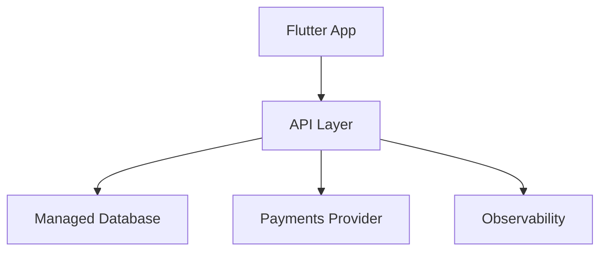

# Architecture (High Level)

Petbae uses a mobile-first client with a lightweight API layer and a managed
data platform. This document avoids code and sensitive implementation details.

## Components
- Flutter mobile app for discovery and profiles
- API layer for authenticated access and business logic
- Managed database with row-level security
- Payments provider for subscriptions or premium features
- Observability and alerting for service health

## Data Flow (Conceptual)

